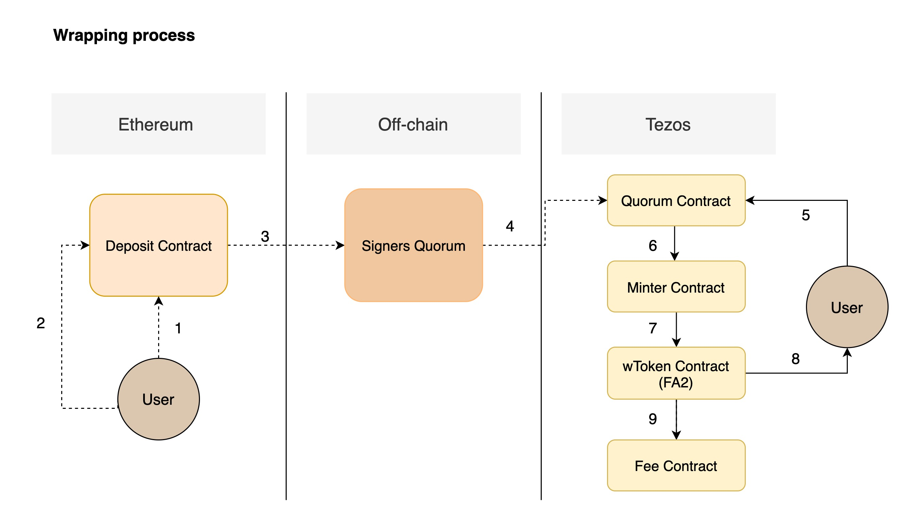
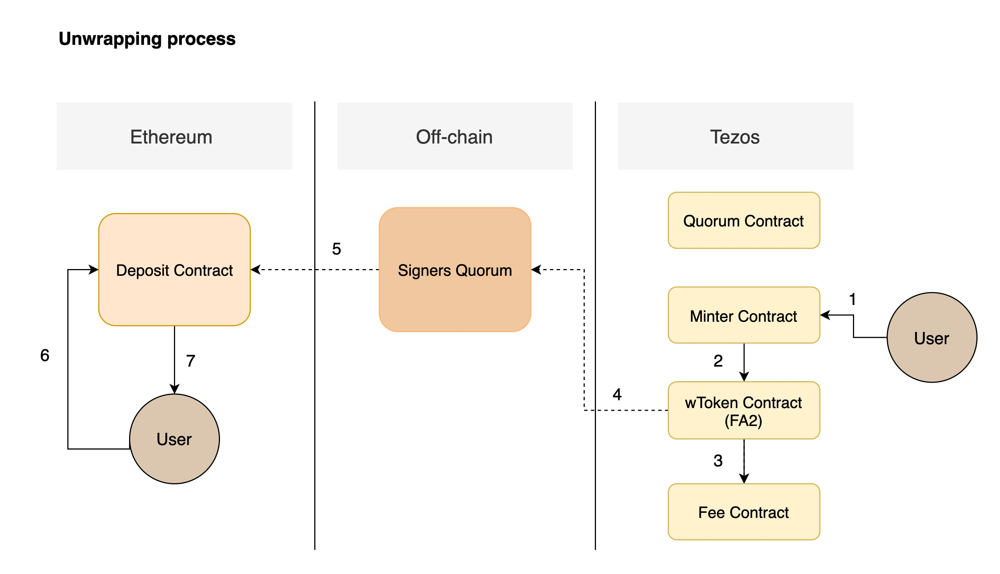

# Using Wrap Protocol

### Wrapping Process

1)  User allows Deposit contract to spend ABC tokens.
    
2)  User wants to wrap N ABC (ERC20 token). User calls Deposit Contract to spend N ABC
    with a TEZ Destination Address. Deposit Contract transfers N ABC from User to itself.
    
3)  Each signer then packages the ETH transaction information and corresponding minting instructions into a payload, signs it with their own cryptographic key and releases the
    signature on IPFS.
    
4)  User gathers at least 3 different signatures and submits them along with an instruction
        to mint N wABC (wrapped ABC, FA2) to the Quorum contract.
        
5)  If the three signatures correspond to 3 members of the Signers Quorum and match the
    minting instructions submitted by User, then Quorum Contract instructs Minter Contract
    to start the process of wrapping N ABC.
    
6)  Minter contract sends two minting instructions to the wToken Contract (m​ int xN wABC
    to Fee Contract and (1-x)N wABC to TEZ Destination Address​).
    
7)  (1-x)N wABC are allocated to the TEZ Destination Address.
    
8) xN wABC are allocated by the wToken Contract to the Fee Contract, which then dispatches it between participants of the protocol.

Want a less technical explanation? Check this out: [What is Wrap? Explain it to Me Like I’m 5](https://medium.com/bender-labs/what-is-wrap-explain-it-to-me-like-im-5-53db5be17c1a)

### Unwrapping Process

1)  User wants to unwrap N wABC. User sends a transaction to Minter Contract allowing them to burn (1-y)N wABC from User’s address and pay yN wABC in unwrapping fees, along with an ETH Destination Address.
    
2)  Minter Contract checks that User owns N wABC and that the unwrapping fee amount y specified by the User is larger than the minimum unwrapping fee. If so, Minter calls the burn method of wToken Contract (b​ urn N wABC from User’s address) ​as well as its mint method (​mint yN wABC to Fee Contract)​
    
3)  wToken Contract burns N wABC from User’s address, then mints yN wABC to Fee Contract
    
4)  Signers watching the Minter Contract wait for a few confirmations after the transactions have been observed before starting the unwrapping process
    
5)  Each signer then packages the corresponding withdrawal transaction information (s​ end (1-y)N ABC to ETH Destination Address)​, signs it with their own private key and releases it on IPFS.
    
6)  User gathers at least 3 different signatures and submits them to the Deposit contract.
    
7)  If the three signatures correspond to 3 members of the Signers Quorum and match the unwrapping instructions submitted by User, then Deposit Contract releases (1-y)N ABC
    and sends them to the ETH Destination Address.
        